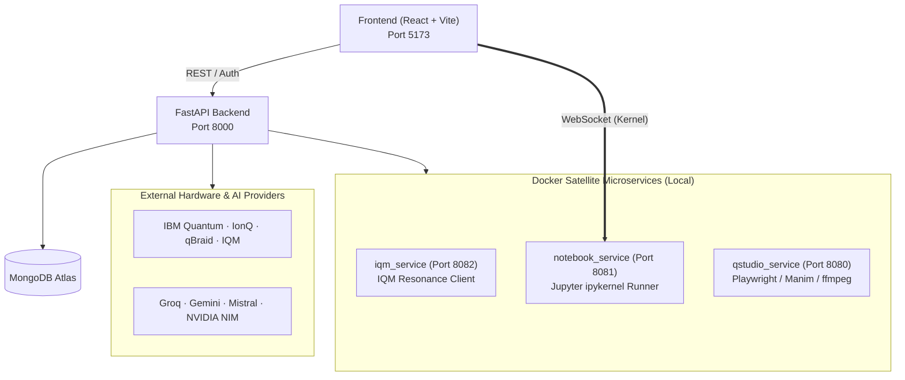

# QxLabs — Quantum Learning Sandbox

[](https://react.dev)
[](https://www.typescriptlang.org)
[](https://fastapi.tiangolo.com)
[](https://www.python.org)
[](https://www.ibm.com/quantum/qiskit)
[](https://threejs.org)
[](https://www.mongodb.com/atlas)

**QxLabs** is a modern, high-performance quantum computing sandbox designed for intuitive experimentation, simulation, and hardware dispatch. Design and simulate multi-qubit circuits with Qiskit Aer, dispatch jobs to real quantum processors via QRoute, and master quantum state mechanics with an interactive 3D Bloch sphere.

---

## The Three Pillars of QxLabs

### 1. Quantum Playground (`/playground`)
- **Drag-and-Drop Circuit Canvas:** Visual workspace to build multi-qubit quantum circuits using standard gates (H, X, Y, Z, S, T, Rx, Ry, Rz, CNOT, CZ, SWAP).
- **Instant Simulation:** Real-time statevector amplitude/phase calculations and measurement probability histograms powered by Qiskit Aer.
- **Monaco Code Editor:** Two-way synchronization between visual circuits, OpenQASM 2.0/3.0, and Python Qiskit code.
- **AI Quantum Tutor:** Context-aware AI physics engine explaining circuit mechanics, state transformations, and gate behaviors.
- **Realistic Noise Modeling:** Opt-in synthetic NISQ noise (thermal relaxation, depolarizing, and readout errors).

### 2. QRoute Dispatcher (`/qroute`)
- **Multi-Vendor Hardware Routing:** Build a circuit once and submit directly to commercial quantum hardware.
- **Supported Providers:** IBM Quantum Cloud, IonQ, qBraid, and IQM Resonance (Garnet 20q, Emerald 54q, Sirius 16q).
- **Modality-First Grouping:** Hardware categorized by physical architecture (Superconducting Transmon vs. Trapped-Ion).
- **Live Job Tracking:** Real-time execution queue polling, status updates, and measurement histogram visualization.
- **Mock Backends:** Zero-cost `:mock` devices for rapid testing without cloud queue latency or credits.

### 3. 3D Bloch Sphere Tasks (`/bloch`)
- **Interactive WebGL Visualizer:** Full 3D single-qubit Bloch sphere built with Three.js / React Three Fiber.
- **State Trajectories:** Real-time animated vector arcs along the sphere surface during state transformations.
- **Coordinate Controls:** Direct manual manipulation of polar ($\theta$), azimuthal ($\phi$), and rotation ($\gamma$) angles.
- **Curated Challenges:** Progressive tasks to build geometric intuition for quantum states with instant completion validation.

---

##  Additional Features

- **Quantum Gate Puzzles (`/puzzles`):** Interactive challenges testing quantum intuition (Match the Gate, State Target transformation).
- **Quantum Gate Library (`/quantum-library`):** Complete reference encyclopedia detailing unitary matrices, Dirac bra-ket notations, formulas, and practical use cases.
- **qBook Notebook (`/qbook`):** Multi-cell interactive Python & Qiskit notebook running over WebSockets against an isolated Jupyter kernel service.
- **qStudio Engine:** AI-powered multimedia educational synthesis (presentation slides, Manim animations, podcasts, and source-grounded RAG).

---

##  Architecture Overview



---

##  Quick Start & Local Setup

### Prerequisites
- **Node.js** (v18+)
- **Python** (v3.9+)
- **Docker** (optional, only needed for local microservices)

### 1. Backend Setup
```bash
cd backend
python -m venv venv

# On Windows:
.\venv\Scripts\Activate
# On macOS/Linux:
# source venv/bin/activate

pip install -r requirements.txt
uvicorn main:app --reload --port 8000
```

### 2. Frontend Setup
```bash
cd frontend
npm install --legacy-peer-deps
npm run dev
```
The app will be running at `http://localhost:5173`.

### 3. Demo Credentials
For instant access without signing up:
- **Email:** `demo@qxlabs.ai`
- **Password:** `quantum123`
*(Or create a new account via the `/signup` screen)*

---

##  Tech Stack

- **Frontend:** React 19, TypeScript, Tailwind CSS, Shadcn UI, Three.js / React Three Fiber, Monaco Editor, Lucide Icons.
- **Backend:** FastAPI (Python), Qiskit, Qiskit Aer, OpenQASM.
- **Database & Auth:** MongoDB Atlas, Native JWT authentication.
- **AI Gateway:** Failover routing across Groq, Gemini, Mistral, NVIDIA NIM, Kimi, and Z.AI with ChromaDB embeddings.
- **Microservices:** Docker, `iqm-client[qiskit]`, `ipykernel`, `Playwright`, `Manim`, `ffmpeg`.

---

##  License
© 2026 QxLabs. All rights reserved.
